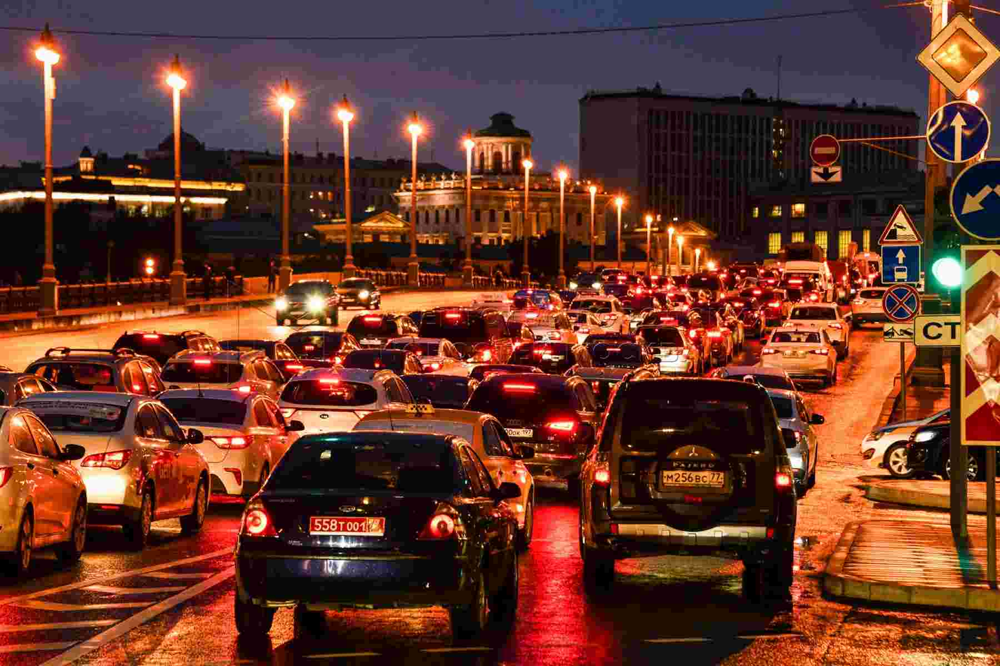

# Car plates detection

Image processing:
1. Read images from specified folder. 
2. Make car plates detection with Yolov5 network.
3. Make OCR of detected plates with EasyOCR framework.
4. Save recognized to specified file.
5. Save images with detected plates in specified folder. 

To start detection:
poetry run python main_detect.py --input_folder 'input_image_file' --output_folder 'output_image_folder' --saved_objects 'saved_objects.csv'

To see all parameters:
poetry run python main_detect.py --help

Config params are saved in config.py

To launch:
1. Before starting the program, you need to install poetry if it is not installed:
curl -sSL https://install.python-poetry.org | python3 -
2. Install dependencies:
poetry install
3. Copy weights file to '/models' folder:
https://drive.google.com/file/d/1y1EZeofOszmFV2vYCMlHwzKrf-Io8dbf/view?usp=sharing

